# 轻量级服务器性能监控看板（踩坑版）

这个版本是第一次操作的时候写的，没有做任何整理，逻辑比较混乱。

## 第 1 天：环境初始化 & 项目骨架

### 【任务】

- 创建 VMware Linux 虚拟机

  现在是在VMware17中安装的ubuntu24.04

  默认安装的图形化界面，本机中可以使用**`Ctrl + Alt + F6`**切换到命令行模式，**`Ctrl + Alt + F2`**返回图形界面

  现在有一个很大的问题就是：物理机复制的内容无法粘贴到虚拟机中，虽然可以使用xshell来规避这个问题，受限于电脑性能还是能少开点软件就少开点。

  先切换到root用户:

  ```
  su - root
  ```

  需要安装tools工具:

  ```
  apt-get install open-vm-tools -y
  apt-get install open-vm-tools-desktop -y
  ```

  最后重启一下

  ```
  reboot
  ```

  当然，为了方便还是要安装一下ssh服务，毕竟xshell真的要好用很多，具体可以参考

  https://blog.csdn.net/weixin_52852052/article/details/126131995?fromshare=blogdetail&sharetype=blogdetail&sharerId=126131995&sharerefer=PC&sharesource=m0_72360152&sharefrom=from_link

  实际操作中与centos一个很大的区别就是：Ubuntu不能直接通过xshell链接root用户，解决办法可以参照https://cloud.tencent.com/developer/article/1596471?shareByChannel=link

- 安装 Python、MySQL、Git

- 初始化项目目录与 Git 仓库

### 【要求】

- 虚拟机能正常联网

  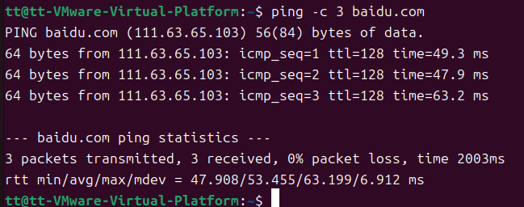

  没有丢包，网络正常

- `python3 --version` 正常

  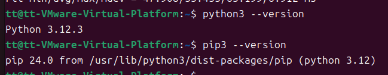

  python3和pip都是正常的

  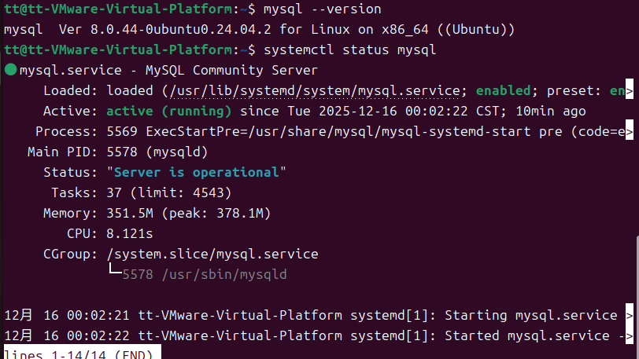

  数据库也在运行

  

  Git也是没有问题的

- 项目目录结构清晰：

  ```
  monitor/
  ├── collector		监控数据采集层（Agent）
  ├── web		Web 服务层（展示 + API）
  ├── sql		数据库结构层（基础设施）
  ├── docs		项目文档（工程素养）
  └── screenshots		项目成果展示
  ```
  
  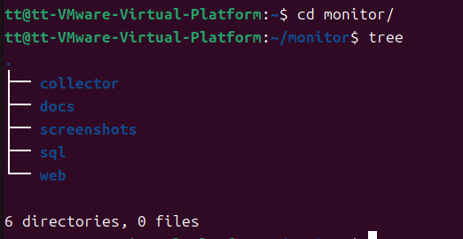
  
  目录结构无问题，准备第二天的任务。想起来一个关机快捷命令：
  
  ```
  shutdown now
  ```
  
  今天完成了Ubuntu 24.04 虚拟机上完成了项目运行环境的初始化，包括 Python、MySQL、Git 的部署，并规划了监控项目的目录结构，为后续采集、存储和 Web 展示模块做准备

------

## 第 2 天：系统指标采集（psutil）

### 【任务】

- 安装 psutil

  - 安装直接pip安装时遇到一个问题   error: externally-managed-environment
  - 这是 **Ubuntu 24.04 + Python 3.12 + PEP 668** 的新机制：

    > **系统 Python 被 apt 管理，禁止 pip 直接往系统环境装包**

    **在 Ubuntu 24.04 上怎么管理 Python 依赖？**

    **Ubuntu 24.04 默认启用了 PEP 668，在项目中可以使用 Python 虚拟环境隔离依赖，避免破坏系统 Python，这也是生产环境中推荐的做法。**

    虚拟环境的配置可以参考https://developer.aliyun.com/article/1597982

    同样，后续所有 Python 操作，都要先进入虚拟环境：

    ```
    cd ~/monitor
    source venv/bin/activate
    ```
    
    用完之后肯定是要退出虚拟环境的，只需运行以下命令：
    
    ```
    deactivate
    ```
    
    

- 编写 Python 脚本采集：
  - CPU 使用率
  - 内存使用率
  - 磁盘使用率

    - 脚本来自网络生成：

      ```
      import psutil
      import time
      
      def collect_metrics():
          # 获取 CPU 使用率，interval=1 表示 1 秒内平均值
          cpu_usage = psutil.cpu_percent(interval=1)
          memory = psutil.virtual_memory()
          disk = psutil.disk_usage('/')
      
          print("===== System Metrics =====")
          print(f"CPU Usage: {cpu_usage}%")
          print(f"Memory Usage: {memory.percent}%")
          print(f"Disk Usage: {disk.percent}%")
          print(f"Timestamp: {time.strftime('%Y-%m-%d %H:%M:%S')}")
          print("==========================")
      
      if __name__ == "__main__":
          collect_metrics()
      
      ```

      

### 【要求】

- 脚本可独立运行

- 每次运行都能输出最新数值

  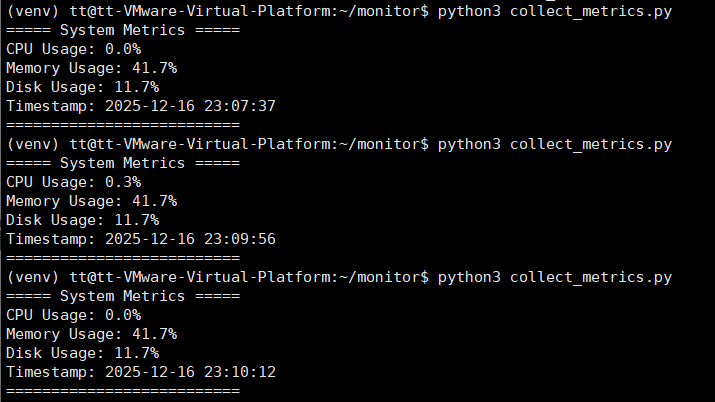

  当前虚拟机处于空载状态，CPU使用率变化不大

- 代码有基础注释

  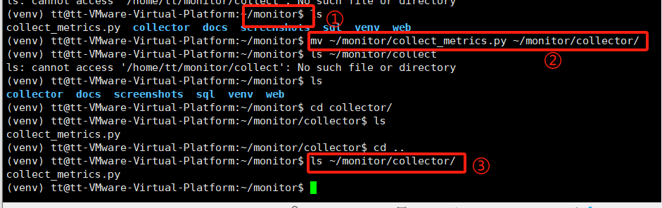

  中间有一个小问题就是：①处发现脚本文件放错位置了，移动一下就好了

  - 最后尝试推送到github

    - 需要注意的一点就是，GitHub 已经禁用了密码认证，在 Linux 上通过配置 SSH Key 进行身份认证，避免明文凭证，同时也更适合自动化和长期使用。

      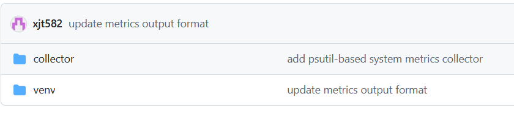

      推送成功了

------

## 第 3 天：MySQL 数据库设计

### 【任务】

- 创建监控数据库

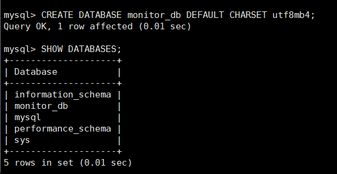

- 创建监控数据表

  ```
  USE monitor_db;
  
  CREATE TABLE system_metrics (
      id INT PRIMARY KEY AUTO_INCREMENT,
      cpu_usage FLOAT NOT NULL,
      mem_usage FLOAT NOT NULL,
      disk_usage FLOAT NOT NULL,
      created_at DATETIME NOT NULL
  );
  ```

  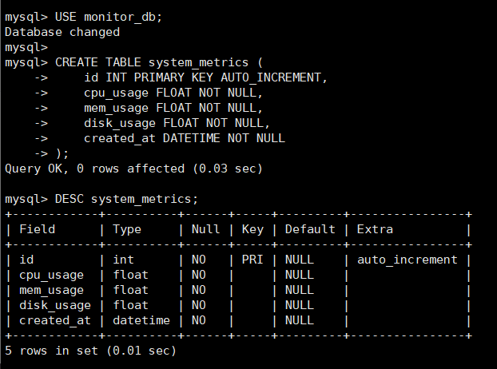

- 保存 SQL 文件

  创建脚本

  ```
  import psutil
  import pymysql
  from datetime import datetime
  
  cpu = psutil.cpu_percent(interval=1)
  mem = psutil.virtual_memory().percent
  disk = psutil.disk_usage('/').percent
  now = datetime.now()
  
  conn = pymysql.connect(
      host='localhost',
      user='monitor',
      password='monitor123',
      database='monitor_db'
  )
  
  cursor = conn.cursor()
  
  sql = """
  INSERT INTO system_metrics (cpu_usage, mem_usage, disk_usage, created_at)
  VALUES (%s, %s, %s, %s)
  """
  
  cursor.execute(sql, (cpu, mem, disk, now))
  conn.commit()
  
  cursor.close()
  conn.close()
  
  print("数据已成功写入 MySQL")
  ```

  遇到一个问题

  ```
  pymysql.err.OperationalError: (1698, "Access denied for user 'root'@'localhost'")
  ```

  **Ubuntu 24.04 下 MySQL 的 root 默认不允许密码登录**

  这是 **Ubuntu 系统的安全设计**

  在 Ubuntu / Debian 系统中：

  - MySQL 的 `root` 用户
  - **默认使用 `auth_socket` 认证**
  - 只允许 **Linux 的 root 用户通过 `sudo mysql` 登录**
  - ❌ 不允许普通程序（Python / pymysql）用 `root` 直接连

  所以会看到：

  ```
  Access denied for user 'root'@'localhost'
  ```

  👉 **这是正常现象，不是错误操作**

  【推荐方案】创建一个“监控专用 MySQL 用户”

  #### 创建一个专用用户（只给必要权限）

  ```
  CREATE USER 'monitor'@'localhost' IDENTIFIED BY 'monitor123';
  ```

  > 说明：
  >
  > - 用户名：`monitor`
  > - 密码：`monitor123`（练习用即可）

  此时有一个新的问题

  ```
  'cryptography' package is required for sha256_password or caching_sha2_password
  ```

  这是一个**“认证插件 vs Python 驱动依赖”问题**：

  - MySQL 8 默认认证方式：`caching_sha2_password`

  - PyMySQL 连接这种用户时：

    - 要么 👉 安装 `cryptography`
    - 要么 👉 把该用户改成 `mysql_native_password`

    #### 【强烈推荐方案】修改 MySQL 用户认证方式（最稳、最常用）

    > 这是 **学习阶段 & 运维实践中最常见方案**
    >  不影响你后续 Flask / Web / crontab
    >  不引入额外 Python 依赖

    再次测试写入数据，成功

    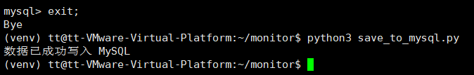

    

### 【要求】

- 表中必须包含时间字段
- 字段类型合理（浮点型 / 时间戳）

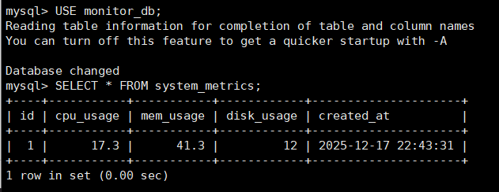

- 能手动插入一条测试数据

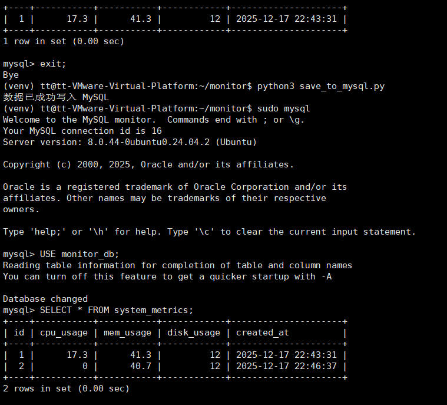

二次写入测试，无误

------

## 第 4 天：采集数据写入数据库

### 【任务】

- 使用 pymysql 连接 MySQL
- 将采集到的系统数据写入数据库
- 处理基本异常情况

### 【要求】

- 脚本运行一次，数据库新增一条记录
- 数据字段值真实可信
- 数据库连接失败时程序不崩溃

------

## 第 5 天：cron 定时任务采集

### 【任务】

- 使用 crontab 配置定时采集
- 验证定时任务正常执行

### 【要求】

- 每分钟自动写入数据
- 使用绝对路径
- 重启系统后 cron 依然生效

------

## 第 6 天：Flask Web 后端接口

### 【任务】

- 搭建 Flask Web 服务

宿主机可以访问


虚拟机本地

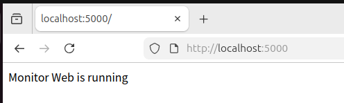

- 提供查询监控数据的 API 接口

### 【要求】

- 浏览器访问接口返回 JSON 数据

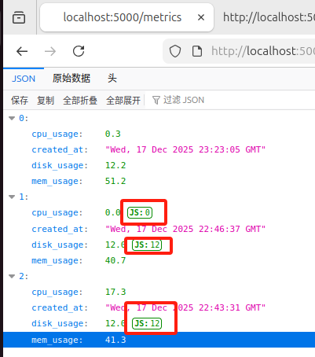

但是发现一个问题，就是图中的JS字样


查看了一下页面源码，并没有，搞了半天是浏览器的问题

```
Data available from the console:

$json.data - The parsed JSON object
$json.text - The original JSON text
$json.headers - HTTP request and response headers
```

​	**Firefox 在你查看 JSON 时，会自动：**

​		把 JSON 解析成 **JS 对象**

​		并在 DevTools 里用 **JavaScript 环境展示**

​		有些字段在「树形视图」里会被标注为 **JS Number / JS value**

换了谷歌浏览器（安装参考Ubuntu 24.04上安装 Google Chrome 浏览器 - xiaochong0302的文章 - 知乎
https://zhuanlan.zhihu.com/p/719864904），一点没问题

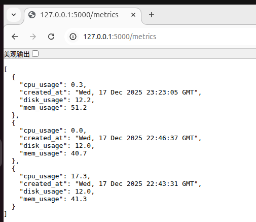

现在已经乱了，做到哪里就写哪里了

# 第 5 天

## 前端页面 + JS 拉取接口 + 展示数据（从 0 到 1）

> 目标一句话：
>  **用浏览器把你采集到的系统数据“看见”**

------

## 一、第 5 天总目标（先知道在干什么）

完成后你将拥有：

- 一个网页 `index.html`
- 一个 JS 文件 `main.js`
- 浏览器通过 `fetch` 调用 `/metrics`
- 页面能**动态显示 CPU / 内存 / 磁盘 / 时间**
- 后端 → 前端 → 浏览器 全链路打通 ✅

------

## 二、第 5 天任务拆分（任务 + 要求 + 总结）

------

### ✅ 任务 1：创建前端目录结构

#### 📌 要做什么

在 `monitor` 项目下：

```
mkdir templates static
```

目录最终结构应为：

```
monitor/
├── app.py
├── save_to_mysql.py
├── templates/
│   └── index.html
├── static/
│   └── main.js
└── venv/
```

#### ✅ 要求

- `templates` 用于 HTML（Flask 约定）
- `static` 用于 JS / CSS（Flask 约定）
- 不要乱放文件

#### 🧠 总结

> Flask **不会随便找 HTML**，
>  `templates/` 和 `static/` 是**约定优于配置**

------

### ✅ 任务 2：修改 Flask，支持页面访问

#### 📌 打开 `app.py`

加上一个页面路由（如果没有）：

```
from flask import Flask, jsonify, render_template
import pymysql

app = Flask(__name__)

@app.route("/")
def index():
    return render_template("index.html")
```

⚠️ 保留你原来的 `/metrics` 接口，不要删。

#### ✅ 要求

- 浏览器访问 `http://127.0.0.1:5000/`

- 不报错（哪怕页面是空的）

  电脑重新开机，先进入虚拟环境

  ```
  cd ~/monitor
  source venv/bin/activate
  ```

  然后启动脚本

  ```
  python3 app.py
  ```

  Flask 是**模块化设计**的：

  - `Flask` → 创建应用
  - `jsonify` → 返回 JSON
  - `render_template` → 渲染 HTML

  看结果

  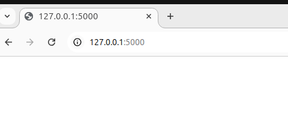

  目前html文件中没有写任何内容，空白页面没有问题

------

### ✅ 任务 3：编写最简单的 HTML 页面

#### 📌 创建 `templates/index.html`

```
<!DOCTYPE html>
<html lang="zh-CN">
<head>
    <meta charset="UTF-8">
    <title>系统监控面板</title>
</head>
<body>

<h1>系统监控数据</h1>

<div id="data">
    正在加载数据...
</div>

<script src="/static/main.js"></script>
</body>
</html>
```

#### ✅ 要求

- 页面能正常打开
- 显示「正在加载数据...」

#### 🧠 总结

> HTML 只负责 **占位**
>  真正的数据交给 JS

------

### ✅ 任务 4：用 JS 调用后端接口

#### 📌 创建 `static/main.js`

```
fetch("/metrics")
    .then(response => response.json())
    .then(data => {
        console.log("后端返回的数据：", data);

        const div = document.getElementById("data");
        let html = "";

        data.forEach(item => {
            html += `
                <p>
                    时间：${item.created_at}<br>
                    CPU：${item.cpu_usage}%<br>
                    内存：${item.mem_usage}%<br>
                    磁盘：${item.disk_usage}%
                </p>
                <hr>
            `;
        });

        div.innerHTML = html;
    })
    .catch(err => {
        console.error(err);
        document.getElementById("data").innerText = "加载失败";
    });
```

#### ✅ 要求

- Chrome 控制台无红色报错
- 页面显示数据库里的数据
- `console.log` 能看到 JSON

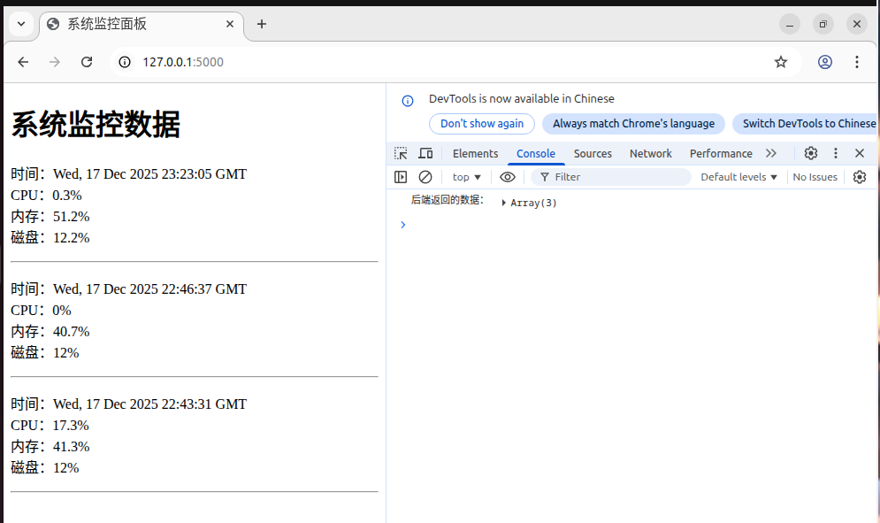

再次尝试写入一条数据

```
python3 save_to_mysql.py
python3 app.py
```

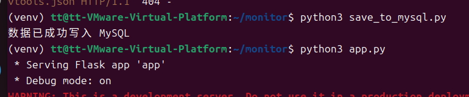

刷新页面：4条数据，没有问题


# 第 6 天：ECharts 打造服务器监控看板（核心展示）

## 🎯 今天目标（先看结果）

完成后，你的页面将具备：

- ✅ CPU 使用率折线图
- ✅ 内存使用率折线图
- ✅ 磁盘使用率折线图
- ✅ 时间轴展示历史趋势

> 这一步 **直接决定你项目展示效果和简历说服力**

------

## 一、先确认你的项目目录（非常重要）

在 `~/monitor` 下执行：

```
ls
```

你现在应该至少有：

```
app.py
save_to_mysql.py
collect_metrics.py
venv/
```

------

## 二、创建标准 Flask 目录结构（像真实项目）

### 1️⃣ 创建 templates 目录

```
mkdir templates
```

### 2️⃣ 创建前端页面

```
nano templates/index.html
```

------

## 三、完整 `index.html`（你 **原样复制**）

> ⚠️ 不要改变量名，先跑通

```
<!DOCTYPE html>
<html lang="zh-CN">
<head>
    <meta charset="UTF-8">
    <title>服务器性能监控</title>

    <!-- 引入 ECharts -->
    <script src="https://cdn.jsdelivr.net/npm/echarts/dist/echarts.min.js"></script>
</head>
<body>

<h2>服务器性能监控面板</h2>

<div id="cpu" style="width: 800px; height: 300px;"></div>
<div id="mem" style="width: 800px; height: 300px;"></div>
<div id="disk" style="width: 800px; height: 300px;"></div>

<script>
fetch("/metrics")
  .then(res => res.json())
  .then(data => {

    // 数据反转（按时间正序）
    data.reverse();

    let times = data.map(i => i.created_at);
    let cpu = data.map(i => i.cpu_usage);
    let mem = data.map(i => i.mem_usage);
    let disk = data.map(i => i.disk_usage);

    function draw(id, title, values) {
        let chart = echarts.init(document.getElementById(id));
        chart.setOption({
            title: { text: title },
            tooltip: { trigger: 'axis' },
            xAxis: { type: 'category', data: times },
            yAxis: { type: 'value', max: 100 },
            series: [{
                type: 'line',
                data: values,
                smooth: true
            }]
        });
    }

    draw("cpu", "CPU 使用率 (%)", cpu);
    draw("mem", "内存 使用率 (%)", mem);
    draw("disk", "磁盘 使用率 (%)", disk);
});
</script>

</body>
</html>
```

保存退出：
 `Ctrl + O` → 回车 → `Ctrl + X`

------

## 四、确认 Flask 能找到这个页面

你的 `app.py` 里这段已经是对的：

```
@app.route("/")
def index():
    return render_template("index.html")
```

------

## 五、重启 Flask

```
Ctrl + C
python3 app.py
```

看到：

```
Running on http://0.0.0.0:5000/
```

------

## 六、浏览器访问（关键时刻）

打开：

```
http://127.0.0.1:5000/
```

你应该看到：

- 三个折线图
- 横轴是时间
- 纵轴是百分比
- 曲线能变化

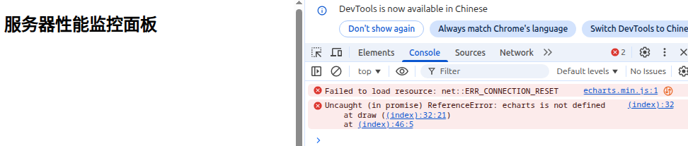

“这ChatGPT有时候也挺让人头疼的“

**经过了漫长的检查后**

❌ 问题不在你的 JS
 ❌ 问题不在 Flask
 ❌ 问题不在 `/metrics`

👉 **问题 100% 出在这一行：**

```
<script src="https://cdn.jsdelivr.net/npm/echarts/dist/echarts.min.js"></script>
```

------

## 一、根因分析（为什么会 `echarts is not defined`）

### jsDelivr 的规则是：

> **必须指定版本号**

你现在用的是：

```
https://cdn.jsdelivr.net/npm/echarts/dist/echarts.min.js
```

这个地址在 **很多环境下会：**

- 返回 404
- 被 CDN 重置（`ERR_CONNECTION_RESET`）
- 实际没有加载任何 JS

**结果就是：**

```
echarts === undefined
```

但浏览器不会在 HTML 中直接报错，只会在你用它的时候炸。

------

## 二、立刻修复（推荐 2 种方式）

### ✅ 方案一（最推荐）：指定版本号（稳定）

把这一行 **直接替换** 为：

```
<script src="https://cdn.jsdelivr.net/npm/echarts@5.4.3/dist/echarts.min.js"></script>
```

这是 **ECharts 5 的稳定版本**。

------

### ✅ 方案二（国内更稳）：Staticfile CDN

如果你在国内 / CDN 不稳定，直接用这个：

```
<script src="https://cdn.staticfile.org/echarts/5.4.3/echarts.min.js"></script>
```

👉 **对新手 & 运维学习者更友好**

直接用方案二，结果展示：
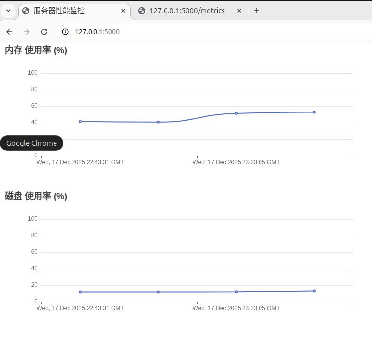

## 七、今天完成了什么？

> ✔ 使用 Flask 提供监控数据 API
>  ✔ 使用 ECharts 构建实时性能监控看板
>  ✔ 实现服务器 CPU / 内存 / 磁盘趋势可视化
>  ✔ 监控数据从采集 → 存储 → 展示的完整链路

#  第 5 天

[^]: （AI总是会在意想不到的地方出错）

## 主题：采集自动化 + 基础告警机制（运维意识提升日）

> 这一整天的目标只有一句话：
>  **“让系统自己跑起来，并在异常时给你提示。”**

------

## 一、今天你在「项目经历」里要补强的能力点

- 运维不是“手动跑脚本”
- 运维一定要有：
  - **自动采集**
  - **异常意识（哪怕是最简陋的）**
- 让面试官看到你**不是只会画图**

------

## 二、今日任务拆解（任务 + 要求 + 完成标准）

------

## ✅ 任务一：采集脚本自动化（crontab）

### 🎯 目标

让 `collect_metrics.py + save_to_mysql.py` **自动定时运行**

------

### 你要做的事

1️⃣ 合并或串联采集与入库逻辑
 （推荐：一个脚本完成采集 + 写库）

​	对之前的采集和入库进行了规范，就不贴代码了

​	出现了一个尴尬的小问题，进入monitor数据库用户的时候忘记密码了，之前在 `save_to_mysql.py` 里使用的数据库用户密码：

```
user="monitor",
password="monitor123",
```


#### 这个用户 `monitor` 是干什么的？

这是一个**典型的运维设计**：

| 用户    | 用途                       |
| ------- | -------------------------- |
| root    | 管理数据库（建库、建用户） |
| monitor | 应用程序写监控数据         |

### 进入 MySQL

```
mysql -u monitor -p
USE monitor_db;
```

------

###  查看最新一条数据

```
SELECT cpu_usage, mem_usage, disk_usage, created_at
FROM system_metrics
ORDER BY created_at DESC
LIMIT 3;
```


2️⃣ 使用 `crontab` 每分钟采集一次


#### 1️⃣ 新建脚本 `collector/run_collector.py`

逻辑结构：

```
from collect_metrics import collect_metrics
from save_to_mysql import save_to_db

data = collect_metrics()
save_to_db(data)
```

> 你之前已经把功能拆得很好，这一步就是**运维式整合**

------

#### 2️⃣ 测试脚本

```
(venv) python3 collector/run_collector.py
```

数据库中 **新增一条记录** → 成功 ✅

------

#### 3️⃣ 写 crontab

```
crontab -e
```

加入一行（注意使用 venv 的 python）：

```
*/1 * * * * /usr/bin/python3 /home/tt/monitor/collector/run_collector.py >> /home/tt/monitor/collector/collector.log 2>&1
```

### 这行命令是什么意思（你必须懂）👇

| 部分               | 说明         |
| ------------------ | ------------ |
| `*/1 * * * *`      | 每 1 分钟    |
| `/usr/bin/python3` | 指定 Python  |
| `run_collector.py` | 执行采集程序 |
| `>> collector.log` | 追加日志     |
| `2>&1`             | 错误也写日志 |

------

### ✅ 完成标志

- 等 3 分钟

- MySQL 中多了 3 条新数据

  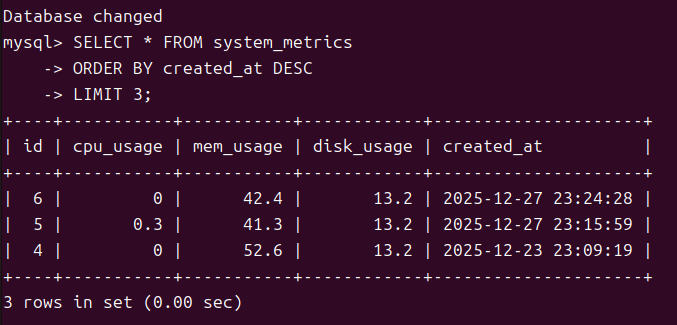

  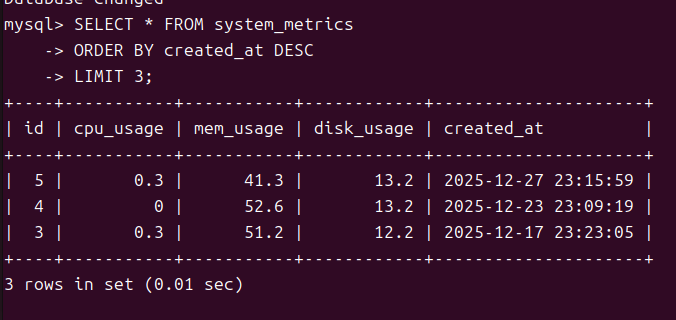

  

- 页面刷新，图表自动变长

  回到监控面板

  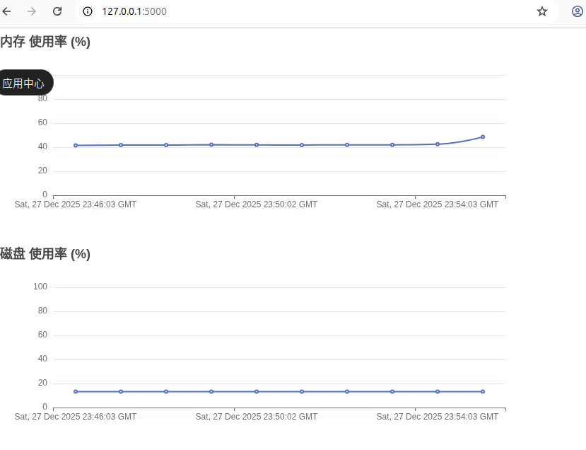

------

## ✅ 任务二：最基础的“运维告警意识”

> **不是短信、不是邮件**
>  👉 是：**“系统已经知道不正常了”**

------

- ## 🚨 构建服务器性能告警系统（CPU / 内存 / 磁盘）

  > 目标：
  >  当服务器资源超过阈值时，**自动触发告警（先用控制台 + 日志）**

  这是所有监控系统（Zabbix / Prometheus / 云监控）的**核心思想**。

  ------

  ## 一、设计思路（先别写代码）

  我们要做的事：

  ```
  采集数据
     ↓
  判断是否超阈值
     ↓
  触发告警（打印 / 记录）
  ```

  ------

  ## 二、设定告警规则（你现在这样定就对）

  ```
  CPU 使用率   > 80%  → 告警
  内存使用率  > 85%  → 告警
  磁盘使用率  > 90%  → 告警
  ```

  ------

  ## 三、新建告警模块（非常重要）

  ### 📁 新文件

  ```
  collector/alert.py
  ```

  ------

  ### 📄 alert.py（直接照抄）

  ```
  from datetime import datetime
  
  CPU_THRESHOLD = 80
  MEM_THRESHOLD = 85
  DISK_THRESHOLD = 90
  
  def check_alert(cpu, mem, disk):
      alerts = []
      now = datetime.now().strftime("%Y-%m-%d %H:%M:%S")
  
      if cpu > CPU_THRESHOLD:
          alerts.append(f"[{now}] ⚠ CPU 使用率过高: {cpu}%")
  
      if mem > MEM_THRESHOLD:
          alerts.append(f"[{now}] ⚠ 内存使用率过高: {mem}%")
  
      if disk > DISK_THRESHOLD:
          alerts.append(f"[{now}] ⚠ 磁盘使用率过高: {disk}%")
  
      return alerts
  ```

  ------

  ## 四、改造 run_collector.py（核心整合）

  ### 示例结构（重点看逻辑）

  ```
  from collect_metrics import collect_metrics
  from save_to_mysql import save_to_mysql
  from alert import check_alert
  
  def main():
      cpu, mem, disk = collect_metrics()
  
      save_to_mysql(cpu, mem, disk)
  
      alerts = check_alert(cpu, mem, disk)
      for alert in alerts:
          print(alert)
  
  if __name__ == "__main__":
      main()
  ```

  ⚠️ 如果你的 `collect_metrics()` 现在只是 print，
   你需要改成 **return 数据**。

  ------

  ## 五、验证告警是否有效（实战技巧）

  ## 真实场景验证（模拟生产事故）

  ### 方法一：制造 CPU 压力（推荐）

  ```
  sudo apt install stress -y
  stress --cpu 2 --timeout 60
  ```

  然后同时执行：

  ```
  python run_collector.py
  ```

  ### 你应看到：

  ```
  ⚠️ CPU 使用率过高: 96.7
  ```

  ### 方法二：占用内存（了解即可）

  ```
  stress --vm 1 --vm-bytes 80% --timeout 30
  ```

  遇到一个问题

  ```
  Traceback (most recent call last):
    File "/home/tt/monitor/collector/run_collector.py", line 14, in <module>
      main()
    File "/home/tt/monitor/collector/run_collector.py", line 6, in main
      cpu, mem, disk = collect_metrics()
      ^^^^^^^^^^^^^^
  ValueError: too many values to unpack (expected 3)
  ```

  这个报错**非常典型，也非常有价值**，你已经踩到「函数返回值设计」这个很多新手都会踩的坑了 👍
   我们一步一步来，保证你**不仅修好，而且知道为什么错**。

  ------

  ## 一、错误翻译成人话（先看懂）

  报错核心只有这一句：

  ```
  ValueError: too many values to unpack (expected 3)
  ```

  出错代码：

  ```
  cpu, mem, disk = collect_metrics()
  ```

  👉 **含义**：

  > `collect_metrics()` 返回的值 **数量 ≠ 3**
  >  但你却试图用 3 个变量去接

  ------

  ## 二、根因分析（一定要对上你自己的代码）

  ### 你现在的 `collect_metrics.py`（根据你前面贴的）

  ```
  def collect_metrics():
      cpu_usage = psutil.cpu_percent(interval=1)
      memory = psutil.virtual_memory()
      disk = psutil.disk_usage('/')
  
      print("===== System Metrics =====")
      print(f"CPU Usage: {cpu_usage}%")
      print(f"Memory Usage: {memory.percent}%")
      print(f"Disk Usage: {disk.percent}%")
      print(f"Timestamp: {time.strftime('%Y-%m-%d %H:%M:%S')}")
      print("==========================")
  ```

  ⚠️ **关键问题**：

  👉 这个函数 **没有 return**

  在 Python 中：

  ```
  def f():
      pass
  ```

  等价于：

  ```
  def f():
      return None
  ```

  但你现在的报错是 **too many values**，说明你后来**改过**它，很可能是这样👇

  ------

  ### 很可能你现在的真实代码是这种（常见情况）

  ```
  return cpu, mem, disk, now
  ```

  或者：

  ```
  return cpu, mem, disk, created_at
  ```

  ➡️ **返回了 4 个值**

  而 `run_collector.py` 里却是：

  ```
  cpu, mem, disk = collect_metrics()
  ```

  ❌ 数量对不上 → 直接报错

  ## 三、标准解决方案（只推荐这一种）

  ###  统一「函数返回值 = 使用方接收值」

  解决！！！

  出现了一件非常痛苦的事情：

  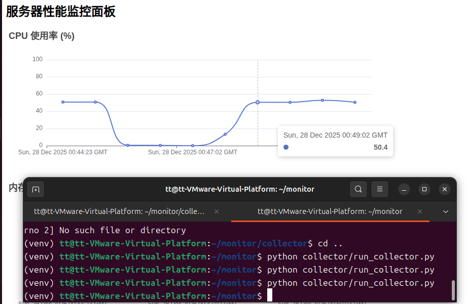

  在压力测试中，cpu已经占用50%以上了，为了测试告警是否生效，我将cpu的告警值调整为3%了，但是反复测试都没有告警结果：

  > **你的告警逻辑是“对的”，只是“没人把它说出来”**

  下面我用「一句话结论 → 原因 → 正确改法 → 验证方法」给你讲清楚。

  ------

  #### 一句话结论（重点）
  
  > ❌ 现在**没有告警输出**，不是因为没触发
  >  ✅ 而是因为 **`check_alert()` 只“返回了告警”，但没有任何地方“打印或处理它”**

​	这一段非常关键 👇

```
alerts = check_alert(cpu, mem, disk)

for alert in alerts:
    print(alert)
```

👉 **这一步，才是真正把“告警”展示出来**

结果展示

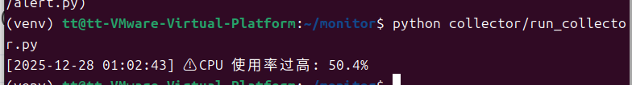

------

# 第 6 天目标（今天你在做什么）

> **把“告警”从打印升级为“可追溯的数据”**

也就是：
 **告警 → 写入数据库 → 后续可在 Web 页面展示**

这是运维项目里**非常关键的一步**。

------

## 一、今天完成后，你将具备的能力

完成今天后，你可以：

> 实现服务器性能监控系统，支持 **指标采集、阈值告警、告警记录持久化及历史查询**

------

## 二、第 6 天任务拆解（任务 + 要求 + 验收）

------

## ✅ 任务 1：设计告警表（数据库层）

**告警相关的数据表，建议就在 `monitor_db` 这个数据库中单独创建一张表**（不是在已有的 `system_metrics` 表里）。

------

## 一、当前整体结构回顾（你没走错）

现在你的项目逻辑是：

```
collector/
├── collect_metrics.py   # 采集 CPU / 内存 / 磁盘
├── save_to_mysql.py     # 保存 system_metrics
├── alert.py             # 判断是否触发告警
├── run_collector.py     # 总入口
```

目前你已经做到：

- ✅ system_metrics 表在持续写入
- ✅ crontab 每分钟执行
- ✅ 告警逻辑函数已写好（check_alert）

**下一步：需要一个地方“存放告警结果”**

------

## 二、为什么要单独建一张告警表？

原因很重要：

| 数据类型     | 表               |
| ------------ | ---------------- |
| 监控原始数据 | `system_metrics` |
| 告警记录     | `alerts`（新建） |

👉 不要混在一张表里，否则以后很难统计、查询、展示。

------

## 三、你要创建的表：alerts（就在 monitor_db 里）

### 1️⃣ 进入 MySQL

```
mysql -u monitor -p
```

输入你之前用的密码：

```
monitor123
```

进入后：

```
USE monitor_db;
```

------

### 2️⃣ 创建告警表（**直接复制执行**）

```
CREATE TABLE alerts (
    id INT AUTO_INCREMENT PRIMARY KEY,
    alert_type VARCHAR(20) NOT NULL,   -- cpu / mem / disk
    alert_msg VARCHAR(255) NOT NULL,   -- 告警内容
    metric_value FLOAT NOT NULL,       -- 触发告警的值
    created_at DATETIME DEFAULT CURRENT_TIMESTAMP
);
```

### 字段解释

| 字段          | 含义             |
| ------------- | ---------------- |
| alert_type    | cpu / mem / disk |
| alert_message | 告警文本         |
| alert_value   | 实际值           |
| threshold     | 触发阈值         |
| created_at    | 告警时间         |

​	这里遇到一个问题，

```
ERROR 1142 (42000): CREATE command denied to user 'monitor'@'localhost'
```

 含义是：

> **monitor 这个 MySQL 用户没有 CREATE TABLE 的权限**

它只能：

- INSERT
- SELECT
- UPDATE（可能）

但 **不能建表**。

## 解决方案（有 2 种，推荐第 1 种）

------

## ✅ 方案一（强烈推荐）：用 root 建表（最规范）

### 1️⃣ 退出当前 MySQL

```
exit;
```

------

### 2️⃣ 用 root 登录 MySQL

```
sudo mysql -u root
```

（Ubuntu 默认 root 是免密码的）

------

### 3️⃣ 切换数据库

```
USE monitor_db;
```

------

### 4️⃣ 创建告警表（注意表名）

```
CREATE TABLE alert_logs (
    id INT AUTO_INCREMENT PRIMARY KEY,
    alert_type VARCHAR(20) NOT NULL,
    alert_msg VARCHAR(255) NOT NULL,
    metric_value FLOAT NOT NULL,
    created_at DATETIME DEFAULT CURRENT_TIMESTAMP
);
```

------

### 5️⃣ 验证

```
SHOW TABLES;
```

看到：

```
system_metrics
alert_logs
```

说明成功 ✅

------

### 6️⃣ 退出 root

```
exit;
```

------

## （可选）给 monitor 用户告警表写入权限

一般 **自动就有 INSERT 权限**，如果你想确认：

```
mysql -u monitor -p
USE monitor_db;
INSERT INTO alert_logs (alert_type, alert_msg, metric_value)
VALUES ('cpu', 'test alert', 99);
```

如果没报错 → 权限 OK
 如果报错 → 我教你补授权（很少需要）

------

## 为什么我不推荐你给 monitor CREATE 权限？

因为在真实运维中：

- ❌ 采集程序 ≠ 数据库管理员
- ❌ 程序能建表 = 安全隐患
- ✅ 表结构 → 由 DBA / root 管理
- ✅ 程序 → 只负责写数据


### 3️⃣ 验证表是否存在

```
SHOW TABLES;
```

你应该能看到：

```
system_metrics
alerts
```

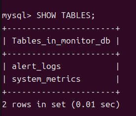

再看结构：

```
DESC alerts;
```

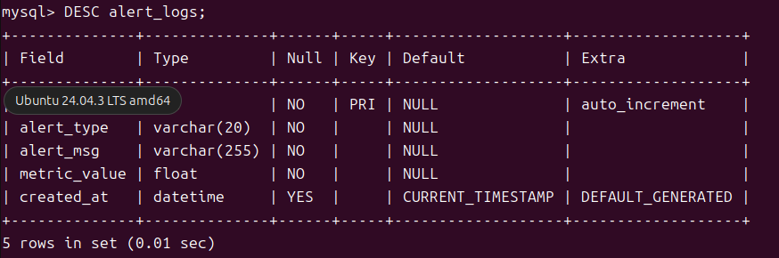

------

## 四、这张表后面会怎么用？

后面你会做三件事（很关键）：

1. **Python 中：**
   - `check_alert()` 返回告警信息
2. **run_collector.py：**
   - 一旦有告警 → 写入 `alerts` 表
3. **监控面板（ECharts）：**
   - 展示“最近告警记录”

------

## ✅ 任务 2：升级 alert.py（核心）

### 当前状态

你现在的 `check_alert()` 是：

- ✔ 判断正确
- ❌ 只返回字符串

我们现在要让它 **直接写库**。

# 第 1 步：明确我们要做什么（先讲清楚）

目标很简单：

> **当 CPU / MEM / DISK 超过阈值时，把告警写入 `alert_logs` 表**

你现在的流程是：

```
collect_metrics
   ↓
save_to_mysql(system_metrics)
   ↓
check_alert
   ↓
print(alert)
```

我们要改成：

```
check_alert
   ↓
save_alert_to_mysql(alert)
```

------

# 第 2 步：确认 alert_logs 表（你这一步是 ✔ 完成的）

你给的表结构👇

```
DESC alert_logs;
id           int          auto_increment
alert_type   varchar(20)
alert_msg    varchar(255)
metric_value float
created_at   datetime DEFAULT CURRENT_TIMESTAMP
```

✅ **完全没问题，设计是正确的**

------

# 第 3 步：新建一个文件 `save_alert.py`

📁 路径（很重要）：

```
monitor/collector/save_alert.py
```

### 内容如下（直接照抄）

```
import pymysql

def save_alert(alert_type, alert_msg, metric_value):
    conn = pymysql.connect(
        host='localhost',
        user='monitor',
        password='monitor123',
        database='monitor_db'
    )

    cursor = conn.cursor()

    sql = """
    INSERT INTO alert_logs (alert_type, alert_msg, metric_value)
    VALUES (%s, %s, %s)
    """

    cursor.execute(sql, (alert_type, alert_msg, metric_value))
    conn.commit()

    cursor.close()
    conn.close()
```

------

# 第 4 步：改造 `alert.py`（这是关键点）

⚠️ **这里非常重要：不要再在 alert.py 里 import 自己**

### 正确的 `collector/alert.py`

```
from datetime import datetime

CPU_THRESHOLD = 3
MEM_THRESHOLD = 85
DISK_THRESHOLD = 90

def check_alert(cpu, mem, disk):
    alerts = []
    now = datetime.now().strftime("%Y-%m-%d %H:%M:%S")

    if cpu > CPU_THRESHOLD:
        alerts.append({
            "type": "CPU",
            "msg": f"[{now}] CPU 使用率过高: {cpu}%",
            "value": cpu
        })

    if mem > MEM_THRESHOLD:
        alerts.append({
            "type": "MEM",
            "msg": f"[{now}] 内存使用率过高: {mem}%",
            "value": mem
        })

    if disk > DISK_THRESHOLD:
        alerts.append({
            "type": "DISK",
            "msg": f"[{now}] 磁盘使用率过高: {disk}%",
            "value": disk
        })

    return alerts
```

📌 **注意变化点**

- 不再返回字符串
- 返回的是 **结构化 dict（为入库准备）**

------

## ✅ 任务 3：run_collector.py 无需大改

改成👇（完整版本）

```
from collect_metrics import collect_metrics
from save_to_mysql import save_to_mysql
from alert import check_alert
from save_alert import save_alert

def main():
    cpu, mem, disk = collect_metrics()

    # 1. 保存指标
    save_to_mysql(cpu, mem, disk)

    # 2. 检查告警
    alerts = check_alert(cpu, mem, disk)

    # 3. 告警写入数据库
    for alert in alerts:
        save_alert(
            alert["type"],
            alert["msg"],
            alert["value"]
        )
        print("告警已记录：", alert["msg"])

if __name__ == "__main__":
    main()
```

------

## 三、立刻验证（非常重要）

### 1️⃣ 保持 CPU_THRESHOLD = 3

### 2️⃣ 执行：

```
python collector/run_collector.py
```

### 3️⃣ 你应该看到：

```
⚠ CPU 使用率过高: 5.7%
```

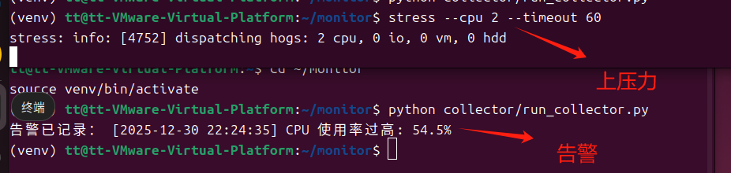

------

### 4️⃣ 查数据库（这是“完成”的标志）

```
SELECT * FROM alert_logs ORDER BY created_at DESC;
```

如果看到记录：

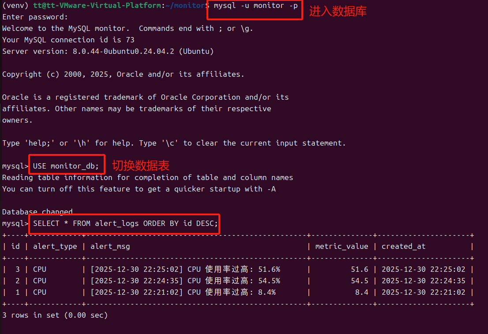

✔ **今天的任务完成**

------

## 四、你现在这个系统的层级（非常重要）

你已经完成了：

| 层级       | 是否完成 |
| ---------- | -------- |
| 指标采集   | ✅        |
| 数据持久化 | ✅        |
| 阈值告警   | ✅        |
| 告警落库   | ✅        |
| 定时运行   | ✅        |

👉 **这是一个完整的运维监控子系统**

# 任务 2

## 👉 在 Flask 页面中展示告警列表

------

## 一、我们现在已有的能力（你已经做得很好了）

你现在已经具备：

- ✅ 指标采集（CPU / MEM / DISK）
- ✅ 指标入库（`system_metrics`）
- ✅ 告警判断（`check_alert`）
- ✅ 告警入库（`alert_logs`）
- ✅ 前端 ECharts 展示性能曲线

**现在只差一件事：**

> 👉 把 `alert_logs` 展示到网页上

------

## 二、新增一个接口：`/alerts`

### 1️⃣ 打开 `app.py`

你现在已有：

```
@app.route("/metrics")
def metrics():
    ...
```

### 2️⃣ 在下面新增 👇

```
@app.route("/alerts")
def alerts():
    conn = get_db_conn()
    cursor = conn.cursor()

    sql = """
    SELECT alert_type, alert_msg, metric_value, created_at
    FROM alert_logs
    ORDER BY created_at DESC
    LIMIT 20
    """

    cursor.execute(sql)
    data = cursor.fetchall()

    cursor.close()
    conn.close()

    return jsonify(data)
```

📌 这个接口作用：

- 从 MySQL 读取最近 20 条告警
- 返回 JSON，供前端使用

------

## 三、修改 `index.html`，加一个「告警区域」

### 1️⃣ 在 `<body>` 里，加一个告警容器

放在你图表下面即可：

```
<h2>⚠️ 告警信息</h2>
<ul id="alert-list"></ul>
```

------

### 2️⃣ 在 `<script>` 里，加告警 JS 逻辑

在你现有的 `fetch("/metrics")` **后面**，再加一个 👇

```
<script>
/* 告警列表 */
fetch("/alerts")
  .then(res => res.json())
  .then(data => {
    let ul = document.getElementById("alert-list");

    if (data.length === 0) {
        ul.innerHTML = "<li>暂无告警</li>";
        return;
    }

    data.forEach(a => {
        let li = document.createElement("li");
        li.innerText = `[${a.created_at}] ${a.alert_type} - ${a.alert_msg}`;
        li.style.color = "red";
        ul.appendChild(li);
    });
});
</script>
```

------

## 四、现在你可以这样验证（一步一步来）

### ✅ 1️⃣ 先确保有告警数据

```
SELECT * FROM alert_logs;
```

确认表里有数据（你之前已经验证过 👍）

------

### ✅ 2️⃣确认 Flask 有 `/alerts` 接口

浏览器直接访问：

```
http://127.0.0.1:5000/alerts
```

你应该看到类似：

```
[
  {
    "alert_type": "cpu",
    "alert_msg": "[2025-01-02 22:01:12] ⚠ CPU 使用率过高: 12%",
    "metric_value": 12,
    "created_at": "2025-01-02 22:01:12"
  }
]
```

❌ 如果这里访问不了 → 问题在 `app.py`
 ✅ 能访问 → 前端一定能显示

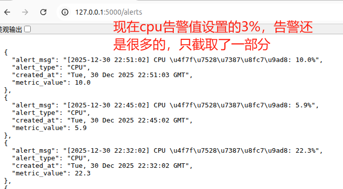

------

### 3️⃣刷新主页

```
http://127.0.0.1:5000/
```

你应该看到：

- 上半部分：**红色告警列表**

- 下半部分：曲线图

  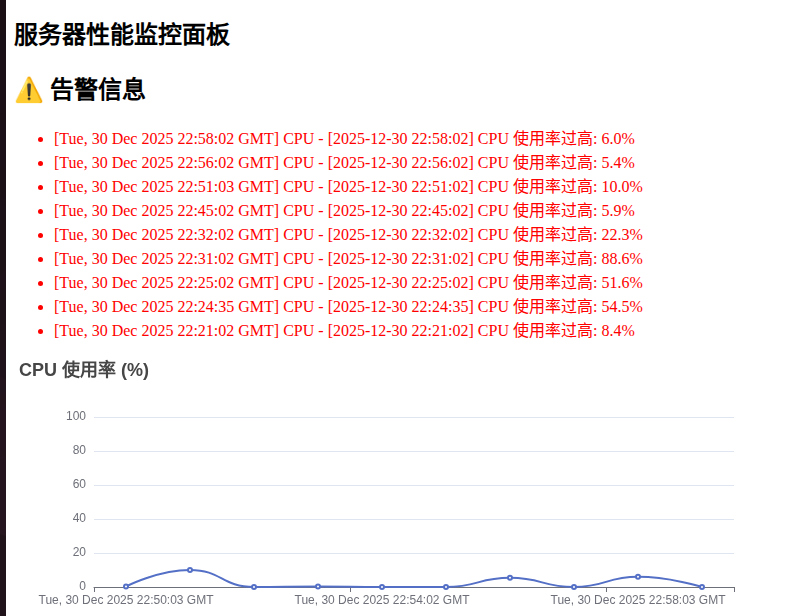

现在还要手动刷新，很麻烦，尝试加入自动刷新告警信息

## 一、你现在的状态（先对齐认知）

你已经有了：

- `/alerts` 接口 ✅
- 告警写入 `alert_logs` 表 ✅
- 前端能 fetch `/alerts` 并显示告警（手动刷新）✅

**现在的问题只有一个：**

> 页面不刷新时，看不到“新告警”

------

## 二、告警自动刷新的核心思路（一定要理解）

运维监控系统 ≠ 页面刷新
 而是：

> **浏览器定时 → 请求接口 → 更新局部 DOM**

我们用的是最基础、最稳的方案：

```
setInterval(() => {
    fetch("/alerts")
}, 10000)
```

👉 **不刷新页面、不重载图表，只更新告警列表**

------

## 三、你现在要改的文件：`index.html`

### 🎯 目标

- 页面一打开：加载一次告警
- 之后：**每 10 秒自动刷新告警**

------

## 四、直接给你「可用版本」（推荐直接替换）

在你现有 `<script>` 中，把**告警那一段**改成这样 👇

### ✅ 告警自动刷新完整代码

```
<script>
/* ===== 告警自动刷新 ===== */

function loadAlerts() {
    fetch("/alerts")
        .then(res => res.json())
        .then(data => {
            let ul = document.getElementById("alert-list");
            ul.innerHTML = "";

            if (data.length === 0) {
                ul.innerHTML = "<li>暂无告警</li>";
                return;
            }

            data.forEach(a => {
                let li = document.createElement("li");
                li.innerText = `[${a.created_at}] ${a.alert_type.toUpperCase()} - ${a.alert_msg}`;
                li.style.color = "red";
                ul.appendChild(li);
            });
        })
        .catch(err => {
            console.error("告警获取失败", err);
        });
}

/* 页面加载立即执行一次 */
loadAlerts();

/* 每 10 秒自动刷新 */
setInterval(loadAlerts, 10000);
</script>
```

⚠️ **注意**

- 这段代码和你原来的图表 JS **不冲突**
- 可以放在同一个 `<script>` 里，也可以分两个 `<script>`

------

## 五、你现在该如何验证（标准运维验证流程）

### 1️⃣ 打开页面

```
http://127.0.0.1:5000/
```

------

### 2️⃣ 再开一个终端，制造 CPU 压力

```
yes > /dev/null &
```

等 10～20 秒（CPU 会明显升高）

------

### 3️⃣ 观察页面行为（关键）

你应该看到：

- ❌ **没有刷新页面**
- ✅ 告警列表 **自动出现新告警**
- ✅ 每 10 秒更新一次（这里有一点，我不太认同ai给出的说法，采集设置的间隔为1分钟，页面设置10秒更新一次应该是有点太频繁了）


------

### 4️⃣ 停止压力测试

```
killall yes
```
